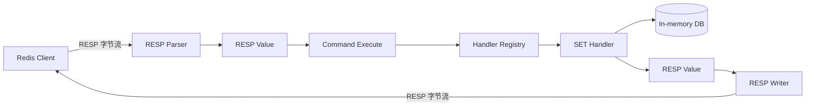

上一篇文章介绍了 Godis 中 RESP2 协议的实现。通过 RESP Parser，Godis 已经能够把客户端发送的字节流解析成 `resp.Value`；通过 RESP Writer，也能够把执行结果重新编码成 RESP 回复。

不过，协议层只解决了客户端与服务端之间如何交换数据的问题。当 Parser 解析出下面这条命令后：

```text
SET name MrSibe
```

Godis 还需要回答两个问题：

1. `name` 和 `MrSibe` 最终应该保存在哪里？
2. Godis 如何知道应该执行 `SET`，而不是 `GET` 或其他命令？

这篇文章将实现 Godis 的内存数据库，并通过一个简单的命令注册表，把 RESP 协议层、命令层和数据库层连接起来。

Github仓库：[MrSibe/godis: A Redis-compatible in-memory key-value store written in Go.](https://github.com/MrSibe/godis)

## 1. 从一个简单的 map 开始

Godis 是一个内存键值数据库，因此最直接的存储方式就是使用 Go 内置的 `map`。如果当前只考虑 String 类型，可以先写成：

```go
type DB struct {
    data map[string]string
}
```

例如 `db.data["name"] = "MrSibe"`。在这个基础上，实现 `SET`、`GET` 和 `DEL` 并不复杂：

```go
func (db *DB) Set(key, value string) {
    db.data[key] = value
}

func (db *DB) Get(key string) (string, bool) {
    value, ok := db.data[key]
    return value, ok
}

func (db *DB) Del(key string) bool {
    if _, ok := db.data[key]; !ok {
        return false
    }

    delete(db.data, key)
    return true
}
```

不过，`map[string]string` 只适合最初的 String 类型。随着项目继续开发，Godis 还需要支持 List、Hash、Set 和 ZSet 等不同的数据类型，因此需要一个更通用的数据表示方式。

## 2. 用 Object 统一表示不同类型的数据

在 Godis 中，我定义了一个 `ObjectType` 表示对象类型：

```go
package database

type ObjectType uint8

const (
    StringType ObjectType = iota
    ListType
    HashType
    SetType
    ZSetType
)
```

然后定义一个 `Object`，同时保存对象类型和实际数据：

```go
type Object struct {
    Type  ObjectType
    Value any
}
```

这样，数据库就不再使用`map[string]string`，而是使用：`map[string]*Object`

## 3. 封装数据库结构与操作

最终，Godis 的数据库结构如下：

```go
type DB struct {
    mu   sync.RWMutex
    data map[string]*Object
}
```

Godis Server 可以接受多个TCP连接，但 Go 内置 map 并不保证无保护的并发读写安全。因此，Godis 使用 `sync.RWMutex` 保护底层 map。

`RWMutex` 是一种读写锁：

- 可以同时被多个读操作持有；
- 写操作需要独占整个锁；
- 有写操作时，其他读写操作都需要等待。

```go
func (db *DB) Set(key string, value *Object) {
    db.mu.Lock()
    defer db.mu.Unlock()

    db.data[key] = value
}

func (db *DB) Get(key string) (*Object, bool) {
    db.mu.RLock()
    defer db.mu.RUnlock()

    value, ok := db.data[key]
    return value, ok
}

func (db *DB) Del(key string) bool {
    db.mu.Lock()
    defer db.mu.Unlock()

    if _, ok := db.data[key]; !ok {
        return false
    }

    delete(db.data, key)
    return true
}
```

## 4. 为什么没有使用 sync.Map

Go 标准库还提供了并发安全的 `sync.Map`，那么为什么 Godis 仍然选择普通 map 加 `RWMutex`？

一个原因是 `sync.Map` 是面向特定访问模式设计的，而不是普通 map 的通用替代品。[Go 官方文档](https://pkg.go.dev/sync)也建议，大多数代码使用普通 map 配合单独的锁，这样能够获得更好的类型安全，也更容易维护与 map 内容相关的其他约束。等到将来通过 Benchmark 确定锁确实成为性能瓶颈后，再考虑分片锁或者其他并发方案会更加合理。

## 5. 从 RESP 到数据库操作

到这里，Godis 已经有了两个独立的模块：RESP 负责字节流与 `resp.Value` 之间的转换，数据库层负责 key 与对象的存储。但二者还没有被连接起来。

以 `SET name MrSibe` 为例，RESP Parser 会把它解析成：

```go
resp.Value{
    Type: resp.Array,
    Array: []resp.Value{
        {Type: resp.BulkString, String: "SET"},
        {Type: resp.BulkString, String: "name"},
        {Type: resp.BulkString, String: "MrSibe"},
    },
}
```

要让这条命令真正写入数据库，中间还需要一个模块完成下面的转换：

```text
["SET", "name", "MrSibe"]
            ↓
找到 SET 对应的执行函数
            ↓
调用 db.Set("name", "MrSibe")
            ↓
返回 +OK
```

最直接的做法是在一个函数里用巨大的 `switch` 分发命令，但命令越来越多时，`switch` 会不断膨胀。因此 Godis 使用命令注册表：用 map 把命令名映射到执行函数，新增命令时只需要注册一条映射。

## 6. 定义统一的 Handler 与命令注册表

为了让所有命令都能放进同一个 map，先定义统一的函数签名：

```go
type Handler func(
    db *database.DB,
    args []resp.Value,
) resp.Value
```

其中 `db` 是所有命令共享的数据库实例；`args` 是除命令名以外的参数，命令名已经由分发器取出。例如 `SET name MrSibe` 对应的 `args` 是 `["name", "MrSibe"]`。

命令层不直接向 TCP 连接写入字节，而是返回一个 `resp.Value`，交给 Writer 序列化。即使命令不需要访问数据库，也保持相同的签名，例如 `PING` 用 `_` 忽略 `db` 参数：

```go
func ping(_ *database.DB, args []resp.Value) resp.Value {
    // ...
}
```

这样，命令注册表就是一张普通的映射表：

```go
var handlers = map[string]Handler{
    "PING":   ping,
    "ECHO":   echo,
    "SET":    set,
    "GET":    get,
    "DEL":    del,
    "EXISTS": exists,
}
```

添加新命令只需要两步：实现一个 Handler，然后在 `handlers` 中注册，分发器完全不需要了解命令内部的实现。Godis 当前注册了 `PING`、`ECHO`、`SET`、`GET`、`DEL` 和 `EXISTS` 六个命令。

## 7. 实现命令分发

分发由 `Execute` 完成，它校验请求格式，取出并规范化命令名，最后从注册表中找到 Handler 并调用：

```go
func Execute(db *database.DB, req resp.Value) resp.Value {
    if req.Type != resp.Array || len(req.Array) == 0 {
        return resp.Value{
            Type:   resp.Error,
            String: "ERR invalid command",
        }
    }

    commandName := strings.ToUpper(req.Array[0].String)

    handler, ok := handlers[commandName]
    if !ok {
        return resp.Value{
            Type:   resp.Error,
            String: "ERR unknown command '" + req.Array[0].String + "'",
        }
    }

    return handler(db, req.Array[1:])
}
```

它依次完成四件事：

1. **校验请求格式**：一条标准命令请求必须是非空 Array。既不是 Array、或者 Array 为空都会返回 `ERR invalid command`；
2. **取出命令名**：Array 的第一个元素；
3. **规范化并查找**：Redis 命令不区分大小写，所以先用 `strings.ToUpper` 转成大写再查表，`GET`、`get`、`Get` 都能命中同一个 Handler；查不到则返回 `ERR unknown command 'xxx'`；
4. **执行**：把 `req.Array[1:]`——去掉命令名后的参数——连同数据库实例一起传给 Handler。

## 8. 实现 SET 与 GET

### 8.1 SET

`SET` 需要两个参数。参数数量不对时直接返回错误；正确时把值包装成 `StringType` 的 Object 写入数据库：

```go
func set(db *database.DB, args []resp.Value) resp.Value {
    if len(args) != 2 {
        return resp.Value{
            Type:   resp.Error,
            String: "ERR wrong number of arguments for 'set' command",
        }
    }

    db.Set(args[0].String, &database.Object{
        Type:  database.StringType,
        Value: args[1].String,
    })

    return resp.Value{
        Type:   resp.SimpleString,
        String: "OK",
    }
}
```

例如 `SET name` 或 `SET name MrSibe extra` 都会因为参数数量不等于 2 而报错。执行成功返回的 `SimpleString("OK")` 会被 Writer 编码为 `+OK\r\n`。

### 8.2 GET

`GET` 只接收一个 key，读取后要区分三种情况：

```go
func get(db *database.DB, args []resp.Value) resp.Value {
    if len(args) != 1 {
        return resp.Value{
            Type:   resp.Error,
            String: "ERR wrong number of arguments for 'get' command",
        }
    }

    obj, ok := db.Get(args[0].String)
    if !ok {
        return resp.Value{
            Type: resp.BulkString,
            Null: true,
        }
    }

    if obj.Type != database.StringType {
        return resp.Value{
            Type:   resp.Error,
            String: "WRONGTYPE Operation against a key holding the wrong kind of value",
        }
    }

    return resp.Value{
        Type:   resp.BulkString,
        String: obj.Value.(string),
    }
}
```

- **key 不存在**：返回 Null Bulk String，被序列化为 `$-1\r\n`。注意不能返回空字符串，因为空字符串本身也可能是合法值；
- **类型不匹配**：key 存在但不是 String 时返回 `WRONGTYPE` 错误。类型检查必须先于类型断言 `obj.Value.(string)`，否则断言会 panic；
- **正常情况**：把 String 内容包装成 Bulk String 返回，例如 `$6\r\nMrSibe\r\n`。

## 9. 实现 DEL 与 EXISTS

### 9.1 DEL

当前 `DEL` 只支持一个 key，删除成功与 key 不存在时分别返回 `:1` 与 `:0`：

```go
func del(db *database.DB, args []resp.Value) resp.Value {
    if len(args) != 1 {
        return resp.Value{
            Type:   resp.Error,
            String: "ERR wrong number of arguments for 'del' command",
        }
    }

    if db.Del(args[0].String) {
        return resp.Value{
            Type:    resp.Integer,
            Integer: 1,
        }
    }

    return resp.Value{
        Type:    resp.Integer,
        Integer: 0,
    }
}
```

### 9.2 EXISTS

`EXISTS` 接收一个或多个 key，统计其中存在的个数：

```go
func exists(db *database.DB, args []resp.Value) resp.Value {
    if len(args) == 0 {
        return resp.Value{
            Type:   resp.Error,
            String: "ERR wrong number of arguments for 'exists' command",
        }
    }

    count := 0
    for _, arg := range args {
        if _, ok := db.Get(arg.String); ok {
            count++
        }
    }

    return resp.Value{
        Type:    resp.Integer,
        Integer: count,
    }
}
```

例如数据库中存在 `a` 和 `b` 时，`EXISTS a b c` 返回 `:2`——三个 key 里只有两个存在。

## 10. 一条 SET 命令的完整执行过程

现在把两篇文章中的模块连接起来：



客户端发送的 `SET name MrSibe` 在网络上被编码成：

```text
*3\r\n$3\r\nSET\r\n$4\r\nname\r\n$6\r\nMrSibe\r\n
```

随后依次发生：

1. Parser 把它解析成 Array 形式的 `resp.Value`；
2. `Execute` 校验请求、取出命令名 `SET`，并从注册表中找到 `set`；
3. `set` 检查参数数量，构造一个 `StringType` 的 Object；
4. `db.Set` 在写锁保护下把对象写入 map；
5. 返回 `SimpleString("OK")`，Writer 编码为 `+OK\r\n` 写回客户端。

服务端每个连接的处理循环中，核心调用只有一行 `command.Execute(s.db, value)`：

```go
for {
    value, err := parser.Parse()
    if err != nil {
        return
    }

    reply := command.Execute(s.db, value)

    if err := writer.Write(reply); err != nil {
        return
    }

    if err := writer.Flush(); err != nil {
        return
    }
}
```

当前 Godis 的 Server 为所有连接共享同一个数据库实例，并在每个连接的处理循环中依次完成解析、执行、序列化和刷新。[GitHub](https://raw.githubusercontent.com/MrSibe/godis/main/internal/server/server.go)

## 12. 当前实现还存在哪些不足

目前的实现已经能支撑基础命令，但仍然是早期版本，存在几个明显的局限。

### 12.1 map 并发安全不等于命令原子性

`DB.Get`、`DB.Set` 和 `DB.Del` 的锁只覆盖单次方法调用。例如 `EXISTS` 循环调用多次 `Get`，每次 `Get` 返回都会释放读锁，两次检查之间其他客户端可能修改数据库。也就是说“每一次 map 访问并发安全”并不等于“整条命令原子”。以后实现多 key 命令和事务时，需要让锁覆盖整条命令，或引入更明确的读写事务接口。

### 12.2 Object 暴露了可变数据

`Get` 直接返回 `*Object`，而 `Object.Value` 是公开的 `any`。String 本身不可变，暂时没有风险；将来加入 List、Hash 这类可变结构后，命令层可能在数据库锁之外修改它们。届时可以让字段私有、为不同类型提供构造函数、把复合对象的修改收敛到数据库锁内，或引入 `View`、`Update` 之类的访问接口。

### 12.3 注册表只有 Handler

参数数量检查由每个 Handler 自己重复编写。以后可以把注册信息扩展成带元数据的结构：

```go
type Command struct {
    Name    string
    Arity   int
    Flags   CommandFlags
    Handler Handler
}
```

分发器就可以统一检查参数，也能为后续的锁、AOF 和权限系统提供命令元数据。

### 12.4 请求参数缺少严格的类型检查

`Execute` 默认请求是 Array 且元素都是 Bulk String，直接读取 `req.Array[0].String`。标准客户端确实符合这个结构，但服务端仍应防御格式错误的请求。后续可以把请求先转换成明确的结构，例如 `Request{Command string; Args [][]byte}`，在转换时统一校验请求类型与参数类型。

### 12.5 命令兼容性有限

当前只实现了最基础的形式：`DEL` 只支持一个 key，`SET` 也还没有过期时间和条件写入等选项，与真实 Redis 的行为仍有差距，需要通过兼容性测试逐步补齐。

## 结语

到这里，Godis 已经拥有了一条完整的基础命令执行链路：

```text
RESP Parser
    ↓
Command Dispatcher
    ↓
Command Handler
    ↓
In-memory Database
    ↓
RESP Writer
```

数据库层用 `map[string]*Object` 保存 key 与对象之间的映射，用 `sync.RWMutex` 保护多个客户端的并发访问；命令层用 `map[string]Handler` 建立命令名与执行函数之间的映射。分发器只负责识别命令，参数检查和具体的数据库操作由对应的 Handler 完成。

这一部分的代码量并不大，但实现之后，我对几个问题有了更具体的认识：

- 一个普通 map 如何被封装成数据库接口；
- key 不存在和空字符串为什么必须区分；
- 多个连接共享数据库时为什么需要进行并发控制；
- 命令逻辑为什么不应该堆在一个巨大的 `switch` 中；
- RESP Value 如何经过命令分发，最终变成一次数据库操作。

目前 Godis 已经可以通过 `redis-cli` 执行 `PING`、`ECHO`、`SET`、`GET`、`DEL` 和 `EXISTS`，但它仍然只是一个不会保存过期时间、重启后会丢失全部数据的内存数据库。
