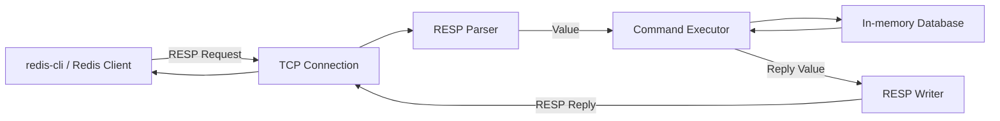

最近我在阅读《Redis设计与实现》这本业界相当有名的书。这本书从数据结构、对象系统、数据库、持久化等角度介绍了 Redis 的内部实现。不过说实话光是看一本书并不会对Redis有太深的印象，边看书边去阅读Redis的源代码才对Redis有更深的印象。为了加深对 Redis 内部设计的理解，我决定使用 Go 实现一个简化版 Redis，并把它命名为 **Godis**。

Github仓库：[MrSibe/godis: A Redis-compatible in-memory key-value store written in Go.](https://github.com/MrSibe/godis)

这篇文章先不讨论数据库和命令实现，而是从整个项目最底层的通信协议开始：**RESP2**。

## 1. Redis 客户端与服务端如何通信

当我们在 `redis-cli` 中输入：

```text
SET name MrSibe
```

客户端并不是简单地把这一行文本原样发送给 Redis。

Redis 客户端和服务端之间使用一种名为 **RESP**（Redis Serialization Protocol）的序列化协议。在 RESP 中，每个值的第一个字节表示这个值的类型，各个协议部分通常使用 `\r\n`，也就是 CRLF 作为结束标记。客户端发送命令时，通常会把命令表示成一个由 Bulk String 组成的 Array。

前面的命令会被编码为：

```text
*3\r\n
$3\r\n
SET\r\n
$4\r\n
name\r\n
$6\r\n
MrSibe\r\n
```

`*3`表示这是一个包含三个元素的数组。

`$3`表示这是长度为 3 字节的 Bulk String，内容为`SET`。后面的元素同理。

命令执行成功后，服务端返回：

```text
+OK\r\n
```

这里开头的 `+` 表示返回值是一个 Simple String。

## 2. RESP2 中的五种基础类型

Godis 当前主要实现的是 RESP2。RESP2 中常见的五种类型如下：

| 类型          | 前缀 | 示例              | 常见用途                   |
| ------------- | ---- | ----------------- | -------------------------- |
| Simple String | `+`  | `+OK\r\n`         | 返回简单成功信息           |
| Error         | `-`  | `-ERR ...\r\n`    | 返回错误                   |
| Integer       | `:`  | `:1\r\n`          | 返回整数                   |
| Bulk String   | `$`  | `$5\r\nhello\r\n` | 返回普通字符串或二进制数据 |
| Array         | `*`  | `*2\r\n...`       | 表示多个 RESP 值           |

需要注意的是，当 `GET` 查询的 key 不存在时，不能返回空字符串，因为空字符串本身也可能是一个合法的值。RESP2 使用 Null Bulk String `$-1`表示不存在，Null Array 则表示为`*-1`。

我在 `Godis`中定义了 `Type`和`Value`来统一表示不同的 RESP 类型：

```go
package resp

type Type byte

const (
    SimpleString Type = '+'
    Error Type = '-'
    Integer Type = ':'
    BulkString Type = '$'
    Array Type = '*'
)

type Value struct {
    Type Type
    String  string
    Integer int
    Array   []Value
    Null bool
}

```

`Type` 决定当前应该读取`Value`的哪个字段：

- Simple String、Error 和 Bulk String 使用 `String`
- Integer 使用 `Integer`
- Array 使用 `Array`
- `Null` 用于区分普通值和 RESP 中的 Null 值

例如：

```go
// +OK\r\n
Value{
    Type:   SimpleString,
    String: "OK",
}
// :1\r\n
Value{
    Type: Integer,
    Integer: 1,
}
```

## 3. 实现 RESP Parser

RESP 解析器的任务，是把网络连接中的字节转换成前面的 `Value`。

Godis 中的 `Parser` 包装了一个 `bufio.Reader`：

```go
type Parser struct {
    reader *bufio.Reader
}

func NewParser(rd io.Reader) *Parser {
    return &Parser{
        reader: bufio.NewReader(rd),
    }
}
```

这里接收的是 `io.Reader`，而不是直接依赖 `net.Conn`。这样设计后，生产环境可以传入 TCP 连接，测试时则可以直接传入字符串，这使解析器和具体的网络连接实现解耦，也让单元测试更加方便。

`Parse` 首先读取一个字节：

```go
func (p *Parser) Parse() (Value, error) {
    prefix, err := p.reader.ReadByte()
    if err != nil {
        return Value{}, err
    }

    switch Type(prefix) {
    case Array:
        return p.parseArray()
    case BulkString:
        return p.parseBulkString()
    default:
        return Value{}, fmt.Errorf(
            "unsupported RESP type: %q",
            prefix,
        )
    }
}
```

### 3.1. 解析 Bulk String

Bulk String 的格式是：

```text
$<字符串长度>\r\n
<字符串内容>\r\n
```

例如`$5\r\nhello\r\n`，解析时，需要先读取长度`5`，然后准确读取 5 字节的正文，以及正文后面的两个 CRLF 字节后终止。

> 这里有个有意思的设计：为什么必须显示声明字符串的长度？
>
> 这是因为 Bulk String 的内容本身可能包含 `\r\n`，所以不能简单地用“读到下一行”的方式。

Godis 中的核心逻辑可以简化为：

```go
func (p *Parser) parseBulkString() (Value, error) {
    line, err := p.readLine()
    if err != nil {
        return Value{}, err
    }

    length, err := strconv.Atoi(line)
    if err != nil {
        return Value{}, err
    }

    if length < 0 {
        return Value{
            Type: BulkString,
            Null: true,
        }, nil
    }

    buf := make([]byte, length+2)
    if _, err := io.ReadFull(p.reader, buf); err != nil {
        return Value{}, err
    }

    return Value{
        Type:   BulkString,
        String: string(buf[:length]),
    }, nil
}
```

Godis 使用 `io.ReadFull` 读取指定长度的数据。只要正文还没有读取完整，它就会继续从底层 Reader 中获取数据。这种方式也更适合处理 TCP 数据没有一次性全部到达的情况。

### 3.2. 递归解析 Array

Array 的格式为：

```text
*<元素数量>\r\n
<元素一>
<元素二>
...
```

例如：

```text
*2\r\n$3\r\nGET\r\n$4\r\nname\r\n
```

解析器首先读出元素数量 `2`，然后调用两次 `Parse`：

```go
func (p *Parser) parseArray() (Value, error) {
    line, err := p.readLine()
    if err != nil {
        return Value{}, err
    }

    length, err := strconv.Atoi(line)
    if err != nil {
        return Value{}, err
    }

    if length < 0 {
        return Value{
            Type: Array,
            Null: true,
        }, nil
    }

    values := make([]Value, 0, length)

    for range length {
        value, err := p.Parse()
        if err != nil {
            return Value{}, err
        }

        values = append(values, value)
    }

    return Value{
        Type:  Array,
        Array: values,
    }, nil
}
```

## 4. 实现 RESP Writer

Parser 负责把字节流转换成`Value`，而 Writer 完全相反：把`Value`转换成字节流。

Godis 的 Writer 同样包装了一个缓冲区：

```go
type Writer struct {
    writer *bufio.Writer
}
```

在 `Write` 方法中，根据 `Value.Type` 选择相应的序列化方式：

```go
switch value.Type {
case SimpleString:
    // +OK\r\n
case Error:
    // -ERR ...\r\n
case Integer:
    // :1\r\n
case BulkString:
    // $5\r\nhello\r\n
case Array:
    // *2\r\n...
}
```

由于底层使用了 `bufio.Writer`，调用 `Write` 后，数据不一定已经写入 TCP 连接。因此，每次回复结束后还需要调用`writer.Flush()`。

Godis 当前的 Writer 可以序列化 Simple String、Error、Integer、Bulk String 和 Array，并能够根据类型输出 `$-1` 或 `*-1` 形式的 Null。

## 5. 一条命令在 Godis 中的完整流程

将 Parser、命令执行器和 Writer 组合起来，一条命令的处理过程如下：



在 Godis 的连接处理函数中，这个过程对应下面的循环：

```go
for {
    value, err := parser.Parse()
    if err != nil {
        return
    }

    reply := command.Execute(db, value)

    if err := writer.Write(reply); err != nil {
        return
    }

    if err := writer.Flush(); err != nil {
        return
    }
}
```

每建立一个客户端连接，Godis 都会为该连接创建一个 Parser 和 Writer。之后不断读取一个完整 RESP 值、执行命令、生成回复并写回连接。

## 6. 当前实现还存在哪些不足

现在的 Godis 实现了满足基础命令通信需要的 RESP2 子集，而不是完整实现了所有 Redis 协议能力。比如说，Parser 只支持作为命令请求使用的 Array 和 Bulk String，没有实现 RESP3，也没有实现 Redis 的 Inline Command 格式。

后续我会继续完善协议解析，并逐步实现命令分发、内存数据库、过期机制和持久化。

## 结语

实现 RESP2 之后，我对 Redis 客户端和服务端之间的通信过程有了更加具体的认识。

原本看起来只是一条简单的：

```text
SET name MrSibe
```

真正进入网络后，会变成带有类型标记和长度信息的字节流。服务端需要解析 Array 和 Bulk String，将其转换为命令与参数；命令执行完成后，又要把结果序列化成不同类型的 RESP 回复。

## 参考资料

- [Redis Protocol specification](https://redis.io/docs/latest/develop/reference/protocol-spec/)

- [MrSibe/godis: A Redis-compatible in-memory key-value store written in Go.](https://github.com/MrSibe/godis)
